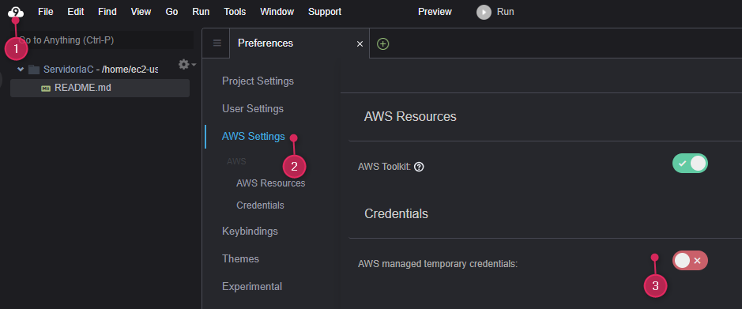

# Prácticas IaC Iniciales en AWS y Azure

[TOC]

## Infraestructura como Código (IaC)

En esta práctica de laboratorio, utilizaremos la Infraestructura como Código (IaC) para crear y gestionar recursos en AWS. IaC nos permite definir y provisionar infraestructura utilizando archivos de configuración, lo que facilita la automatización y la repetibilidad de nuestras implementaciones.

### CloudFormation

AWS CloudFormation es un servicio que nos permite modelar y configurar nuestros recursos de AWS utilizando archivos de texto. Podemos definir nuestros recursos en un archivo YAML o JSON, y luego CloudFormation se encargará de crear y gestionar esos recursos por nosotros.

CloudFormation a partir de un template llamado **`template.yaml`**, define una pila (stack) con el comando **`aws cloudformation deploy`**. Se pueden añadir cambiis incrementales al template y volver a ejecutar el comando para actualizar la pila. Para eliminar la pila, se utiliza el comando **`aws cloudformation delete-stack`**.

La curva de aprendizaje de CloudFormation puede ser empinada y fuera de AWS no nos sirve. Pero es interesante su uso para infraestructuras complejas en diferente regiones y cuando el compliance es importante, ya que permite mantener un control de versiones de la infraestructura y facilita la colaboración entre equipos.

**AWS Severless Application Model** (SAM): es una extensión de CloudFormation que facilita la creación de aplicaciones sin servidor (serverless) en AWS. SAM nos permite definir funciones Lambda, API Gateway, DynamoDB, etc., utilizando una sintaxis simplificada.

**AWS Cloud Development Kit** (CDK): es un marco de desarrollo de software que nos permite definir nuestra infraestructura utilizando lenguajes de programación como TypeScript, Python, Java, etc. CDK nos permite escribir código para definir nuestros recursos de AWS y luego generar automáticamente los archivos de CloudFormation.

### Otras herramientas de IaC

#### Terraform

Es una herramienta de IaC de código abierto que nos permite definir y provisionar infraestructura en múltiples proveedores de nube, incluyendo AWS. Terraform utiliza su propio lenguaje de configuración (HCL) para definir los recursos y luego se encarga de crear y gestionar esos recursos.

Terraform tiene ciertas ventajas sobre CloudFormation, como su capacidad para gestionar recursos en **múltiples proveedores de nube** y su enfoque en la gestión del estado de la infraestructura. El lenguaje HCL de Terraform es más fácil de aprender y usar que el formato JSON o YAML de CloudFormation.

Como deventaja principal sería que Terraform no tiene gestión de secretos integrada como CloudFormation, lo que puede ser un inconveniente para proyectos que requieren un manejo seguro de credenciales y otros datos sensibles.

#### Pulumni

Es otra herramienta de IaC que nos permite definir nuestra infraestructura utilizando lenguajes de programación como JavaScript, TypeScript, Python, Go, etc. Pulumi nos permite escribir código para definir nuestros recursos de AWS y luego generar automáticamente los archivos de CloudFormation. Tiene un poco lo mejor de ambos mundos, ya que combina la facilidad de uso de CDK con la capacidad de gestión de múltiples proveedores de Terraform. Sin embargo, al igual que Terraform, Pulumi no tiene una gestión de secretos integrada y además no está muy implantado y su comunidad es pequeña, lo que puede dificultar la resolución de problemas y la obtención de soporte.

## Cloud9 AWS

Creamos un nuevo entrono llamado **`ServidorIaC`** que el profesor va a poder gestionar desde la nube. Elegimos un **`t3.small`**. Elegimos SSH para poder entrar en la máquina por ejemplo desde Visual Studio Code. Y por último, le damos a crear entorno. Deberíamos **cambiar el disco EBS a 30 GB** para tener más espacio para trabajar. Para ello:

1. Vamos a la consola de EC2.

2. Seleccionamos la instancia de Cloud9 que acabamos de crear.

3. En la pestaña de **`Almacenamiento`**, seleccionamos el volumen EBS asociado a la instancia.

4. Seleccionamos el volumen y el botón **`Acciones`** arriba ala derecha y luego la opción **`Modificar volumen`**.

5. Vuelvo a la consola de Cloud9 y abro el entorno que he creado y en el terminal ejecuto.

    ```bash
    voclabs:~/environment $ sudo lsblk
    NAME          MAJ:MIN RM SIZE RO TYPE MOUNTPOINTS
    nvme0n1       259:0    0  30G  0 disk 
    ├─nvme0n1p1   259:1    0  10G  0 part /
    ├─nvme0n1p127 259:2    0   1M  0 part 
    └─nvme0n1p128 259:3    0  10M  0 part /boot/efi

    voclabs:~/environment $ sudo growpart /dev/nvme0n1 1
    voclabs:~/environment $ df -hT
    voclabs:~/environment $ sudo xfs_growfs -d /
    ```

6. Para que la máquina **pueda usar los servicios del laboratorio**. Vamos a seleccionar la instancia del EC2 y en **`Acciones`**, seleccionamos **`Seguridad`** y luego **`Modificar rol de IAM`**. Seleccionamos el rol que hemos del laboratorio que es **LabInstructorRole** y le damos a **`Actualizar Rol de IAM`**.

7. Desactivamos la opción "**AWS managed temporary credentials**" para que el entorno de Cloud9 utilice las credenciales del rol de IAM que hemos asignado a la instancia. Como se muestra en la siguiente imagen:

    

8. Comprobamos que tenemos acceso a los servicios de AWS con el rol asignado ejecutando el siguiente comando:

    ```bash
    voclabs:~/environment/cursoiac (main) $ aws sts get-caller-identity
    {
        "UserId": "AROAS47IYKXW6XBLVXWHT:i-03c5690a204a184??",
        "Account": "1996672424??",
        "Arn": "arn:aws:sts::199667242477:assumed-role/LabRole/i-03c5690a204a184??"
    }
    ```

    Esto indica que estamos autenticados con el rol de IAM **LabRole** y que tenemos acceso a los servicios de AWS.

## Practica 1: Crear una pila de CloudFormation

Carpeta [sesion2/cloudformation/ReADME.md](../../sesion2/cloudformation/README.md)

## Practica 2: Crear una pila de Terraform en AWS

Carpeta [sesion2/terraform-vpc-instance/README.md](../../sesion2/terraform-vpc-instance/README.md)

Pasos:

1. Instalar Terraform

    Amazon Linux 2023 **no trae Terraform preinstalado**. Instálalo así:

    ```bash
    sudo dnf install -y yum-utils
    sudo yum-config-manager --add-repo https://rpm.releases.hashicorp.com/AmazonLinux/hashicorp.repo
    sudo dnf install -y terraform
    ```

    Verifica que se ha instalado correctamente:

    ```bash
    terraform -v
    ```

2. Comprobar que Terraform tiene acceso a las credenciales de AWS

    Comprueba que puedes ejecutar comandos sin error:

    ```bash
    aws sts get-caller-identity
    ```

3. Me situo donde está el scrip HCL de Terraform, en la carpeta **`sesion2/terraform-vpc-instance`**.

4. Inicializar Terraform

    ```bash
    terraform init
    ```

    Esto descargará los plugins necesarios.

5. Planificar y aplicar la infraestructura

    ```bash
    terraform plan
    terraform apply
    ```

    * **`terraform plan`** mostrará un resumen de los cambios que se van a realizar en la infraestructura. Si todo es correcto, puedes aplicar los cambios con terraform apply.
    * ** **`terraform apply`** aplicará los cambios a la infraestructura. Terraform te pedirá confirmación antes de realizar cualquier cambio y creará un archivo de estado (`.tfstate`) para mantener un registro de los recursos creados.

    !!! info Archivo `.tfstate`"
        `.tfstate` es un archivo que Terraform utiliza para mantener un registro del estado actual de la infraestructura que ha creado. Este archivo es crucial para que Terraform pueda gestionar los recursos de manera eficiente y detectar cambios en la infraestructura. El archivo `.tfstate` contiene información detallada sobre los recursos creados, incluyendo sus identificadores, atributos y relaciones. Es importante mantener este archivo seguro y respaldado, ya que perderlo o corromperlo puede causar problemas al gestionar la infraestructura con Terraform.

6. (Opcional) Refrescar el estado sin aplicar cambios

    ```bash
    terraform refresh
    ```

    Esto actualizará el `.tfstate` con el estado actual de AWS, sin modificar la infraestructura.

7. (Opcional) Destruir todo

    ```bash
    terraform destroy
    ```

## Practica 3: Crear una pila de Terraform en Azure

Carpeta [sesion2/terraform-vn-mv/Readme.md](../../sesion2/terraform-vn-mv/Readme.md)

## Practica 4: Ejemplo de SAM

Carpeta [sesion2/sam-resizer/README.md](../../sesion2/sam-resizer/README.md)

