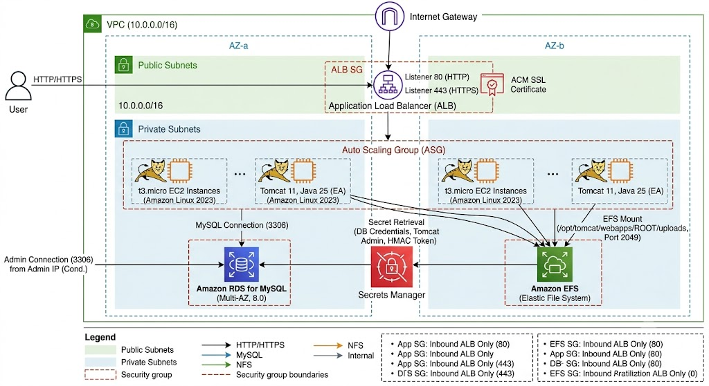
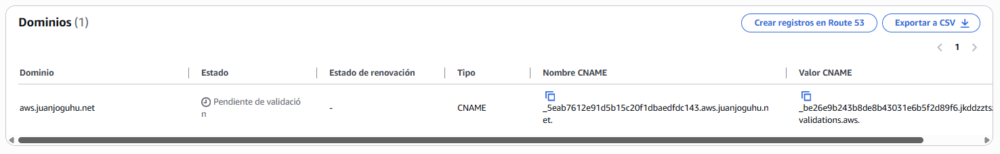
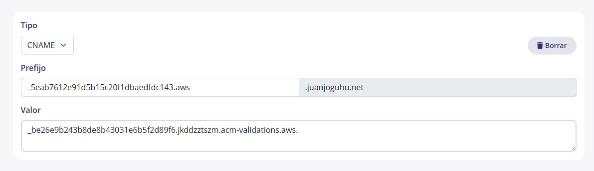
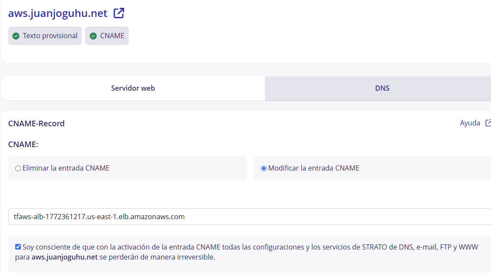

# Indice

[TOC]

## Resumen de las modificaciones propuestas en la arquitectura

!!! Note Nota
    En la instancia de **Cloud9** creada en el laboratorio se ha clonado un repositorio público propio en **`/cursoiac`** es una copia del repositorio del curso en donde en la carpeta **`/cursoiac/MIS_APUNTES`** se han ido tomando notas de las diferentes sesiones. En **`/cursoiac/MIS_APUNTES/sesion4`** se encuentra el código de Terraform modificado para esta propuesta, así como el script de User Data actualizado para instalar Tomcat 11 y Java Corretto 25 en lugar de Wordpress que se han adjuntado junto a esta entrega.

    **El repositorio tiene seteadas unas credenciales de GitHUb hasta Agosto por lo que cualquier commit y push se subirán correctamente al repositorio público de GitHub y se podrán revisar los cambios realizados en el código**.

1. Quitar Wordpress y poner Tomcat 11 con Java 25 en su lugar.
2. Añadir un cetificado SSL/TSL de AWS ACM para servir la aplicación de forma segura bajo HTTPS a la url **https://aws.juanjoguhu.net** (o el dominio que configures en domain_name).
3. Usar AWS Secrets Manager para almacenar de forma segura las credenciales de la base de datos RDS, del administrador de Tomcat y el token de firma hmacSHA256. El script de User Data de las instancias EC2 leerá estas credenciales en caliente al arrancar, evitando hardcodear información sensible.

## Esquema de la arquitectura modificada



## Descripción de los componentes

### Descipción definiciones en `terraform.tfvars`

Este archivo está incluido en el .gitignore y se tomará automáticamente al ejecutar **`terraform apply`**. De lo contrario, si no lo tienes o no lo has rellenado, Terraform te pedirá que introduzcas los valores de estas variables manualmente en la terminal.

```hcl
db_user     = "admin"
db_pass     = "SuperSecureDBPass2026!"
tomcat_user = "tomcatadmin"
tomcat_pass = "ManagerSecurePass2026!"
domain_name = "aws.juanjoguhu.net"

# Permitir acceso de administración directa al RDS solo desde esta IP (en formato CIDR)
admin_ip         = "88.17.35.54/32"

# Clave de 32 caracteres para firma de tokens hmacSHA256
# cada EC2 debería tener una variable de entorno con esta clave para crear 
# la clave clave simétrica HMAC SHA256 de firma de tokens JWT en la 
# aplicación web y su posterior verificación en el backend.
# El backend hace la gestión de usuarios y tokens, y el frontend solo se 
# encarga de generar el token al hacer login y enviarlo en cada petición.
# De esta manera nos evitamos crear una instancia de cognito o un servicio 
# adicional para la gestión de autenticación y autorización, y podemos 
# centrarnos en la parte de infraestructura y despliegue.

hmac_sha_key = "K8#mP2xQzL5vR9wN3jT7bF4cH6eA1dY0"
```

### Componentes de Red (`red.tf`, `variables.tf`)

* **VPC personalizada**: Creación de una red virtual aislada con el bloque CIDR 10.0.0.0/16.  

* **Subredes Públicas y Privadas**: Se despliegan 2 subredes públicas y 2 subredes privadas distribuidas en dos Zonas de Disponibilidad distintas (a y b) para asegurar la alta disponibilidad.  

* **Internet Gateway (IGW) y NAT Gateway**: Las subredes públicas tienen acceso directo a Internet a través del IGW. Las subredes privadas salen a Internet de forma segura (para descargar paquetes o actualizaciones) a través de un NAT Gateway situado en la primera subred pública.  

### Capa de Cómputo y Escalado (`aplicacion.tf`)

* **Application Load Balancer (ALB)**: Desplegado en las subredes públicas para recibir el tráfico externo (HTTP/HTTPS) y distribuirlo eficientemente.  

* **Auto Scaling Group (ASG)**: Configurado en las subredes privadas (aislado de Internet). Mantiene de forma elástica entre 1 y 2 instancias EC2.  

* **Launch Template**: Define cómo se crean las instancias usando Amazon Linux 2023 (t3.micro). Incorpora el script de inicialización (staging-web.sh) embebido mediante templatefile. En este script se instala Java Corretto 25, Tomcat 11 y se configura la aplicación para que lea las credenciales de Secrets Manager en tiempo de arranque.

### Capa de Datos y Almacenamiento (`aplicacion.tf`)

* **Amazon RDS (MySQL 8.0)**: Una base de datos administrada (db.t3.micro) ubicada exclusivamente en las subredes privadas. Las credenciales de acceso se inyectan dinámicamente y de forma segura extraiéndolas desde AWS Secrets Manager.  

* **Amazon EFS (Elastic File System)**: Sistema de archivos compartido y persistente en red. Se monta automáticamente en el directorio **`/opt/tomcat/webapps/ROOT/uploads`** de cada instancia EC2 que levante el ASG, garantizando que si una instancia muere o se escala, los archivos subidos por los usuarios no se pierdan.  

### Seguridad y Gestión de Secretos (seguridad.tf, aplicacion.tf)

* **AWS Secrets Manager**: Almacena de forma centralizada y encriptada un JSON con datos sensibles: credenciales de la BD, del administrador de Tomcat y el token de firma hmacSHA256.  

* **Políticas de Security Groups (Mínimo Privilegio)**:

  * El ALB acepta conexiones abiertas a los puertos 80 y 443.  
  * Las instancias web (EC2) solo aceptan tráfico en el puerto 80 si este proviene estrictamente del Security Group del ALB.  
  * La base de datos (RDS) solo acepta conexiones en el puerto 3306 desde el SG de las EC2 web  (e incluye una regla condicional para acceso de administración externa desde la IP configurada en admin_ip) .  
  * El EFS solo acepta tráfico en el puerto NFS (2049) originado en las instancias web.

    ```puml { align=center }
    @startuml

    ' https://awslabs.github.io/aws-icons-for-plantuml/

    !define AWSPuml https://raw.githubusercontent.com/awslabs/aws-icons-for-plantuml/v23.0/dist

    !include AWSPuml/AWSCommon.puml
    !include AWSPuml/AWSSimplified.puml
    !include AWSPuml/Groups/AWSCloud.puml
    !include AWSPuml/Groups/VPC.puml
    !include AWSPuml/Groups/PublicSubnet.puml
    !include AWSPuml/Groups/PrivateSubnet.puml
    !include AWSPuml/NetworkingContentDelivery/VPCInternetGateway.puml

    hide stereotype
    scale 600 width
    left to right direction
    ' skinparam linetype ortho

    AWSCloudGroup(cloud) {

        VPCInternetGateway(igw, "Internet\nGateway", "")

        VPCGroup(vpc) {
            PublicSubnetGroup(pub_a, "Subred pública") #ivory {
                rectangle "Grupo de seguridad\nbalanceador de carga\nALB" as gs_alb #transparent;line:orange;text:orange;
            }
            PrivateSubnetGroup(priv_a, "Subred privada") #azure {
                rectangle "Grupo de seguridad\nservidor EC2" as gs_ec2 #transparent;line:orange;text:orange;
                rectangle "Grupo de seguridad\nbase de datos" as gs_rds #transparent;line:orange;text:orange;
                rectangle "Grupo de seguridad\nEFS" as gs_efs #transparent;line:orange;text:orange;
            }
        }

        igw --> gs_alb
        gs_alb --> gs_ec2 : encadena
        gs_ec2 --> gs_rds : encadena
        gs_ec2 --> gs_efs: encadena
    }

    @enduml
    ```

## Utilidad de esta Arquitectura

Esta infraestructura está diseñada siguiendo las buenas prácticas de arquitectura en AWS (Well-Architected Framework):

* **Seguridad (DMZ)**: Los servidores de aplicaciones y las bases de datos no tienen IPs públicas; están protegidos en subredes privadas. El único punto de entrada expuesto es el ALB.

* **Alta Disponibilidad**: Si una zona de disponibilidad de AWS sufre una caída, el ALB redirigirá el tráfico a la otra zona y el ASG repondrá las instancias caídas automáticamente.

* **Persistencia del Estado**: Al desacoplar los archivos adjuntos en EFS y los datos estructurados en RDS, las instancias EC2 se vuelven "inmutables" o stateless, facilitando el escalado horizontal continuo.

* **Cifrado y Gestión de Configuración**: Las contraseñas nunca viajan hardcodeadas en los scripts. Al arrancar la máquina, el script de User Data usa la AWS CLI para leer el secreto en caliente directamente desde Secrets Manager.

## Proceso de despliegue y validación del certificado SSL

### Inicialización y despliegue con Terraform

```bash
voclabs:~/environment/cursoiac/MIS_APUNTES/sesion4 (main) $ terraform init
Initializing provider plugins found in the configuration...
- Finding hashicorp/aws versions matching ">= 4.44.0"...
- Installing hashicorp/aws v6.49.0...
- Installed hashicorp/aws v6.49.0 (signed by HashiCorp)

Initializing the backend...


Terraform has created a lock file .terraform.lock.hcl to record the provider
selections it made above. Include this file in your version control repository
so that Terraform can guarantee to make the same selections by default when
you run "terraform init" in the future.

Terraform has been successfully initialized!
```

### Despliegue y validación del certificado SSL

```bash
voclabs:~/environment/cursoiac/MIS_APUNTES/sesion4 (main) $terraform apply

...

Do you want to perform these actions?
  Terraform will perform the actions described above.
  Only 'yes' will be accepted to approve.

  Enter a value: yes

...

aws_acm_certificate_validation.cert_validation: Still creating... [00m00s elapsed]
```

En este punto, el certificado SSL/TSL para tu dominio está en proceso de validación. Para completar este proceso, debes seguir los siguientes pasos:

1. **Validar el Certificado SSL en AWS ACM:**
    * Dirígete a la consola web de AWS y accede al servicio AWS Certificate Manager (ACM).  
    * Verás el certificado para tu dominio en estado "Pending validation" (Validación pendiente).  
    * Entra en los detalles del certificado y localiza la tabla de validación DNS. AWS te proporcionará un Nombre de CNAME y un Valor de CNAME.

        

    * Ve al panel de gestión de DNS del proveedor donde tengas registrado tu dominio en mi caso **STRATO**.
    * Crea un nuevo registro de tipo CNAME pegando esos valores exactos.
  
        

    * **Tardará unos minutos**. AWS comprobará el registro automáticamente y el estado del certificado cambiará a "Issued" (Emitido) y **terraform continuará con el despliegue del ALB y su listener HTTPS**.

2. **Apuntar tu dominio hacia el Application Load Balancer:**
    * En la consola de AWS, accede al servicio EC2 y luego a la sección de Load Balancers.  
    * Localiza tu ALB recién creado (debería llamarse algo como tfaws-alb-xxxx) y **copia su URL pública (DNS name)**.
    * Vuelve al panel de gestión de DNS de tu proveedor de dominio.  
    * Crea un registro de tipo CNAME para tu subdominio (por ejemplo, aws si deseas mapear aws.juanjoguhu.net) apuntando directamente a la URL larga del ALB que acabas de copiar.

        

    * Una vez propagados los cambios de DNS, cualquier petición que entre por HTTP (puerto 80) al dominio será redirigida por el listener del ALB de forma segura mediante un código 301 hacia HTTPS (puerto 443) , sirviendo tu aplicación web Tomcat bajo una conexión cifrada y segura.  

Tras completar el espacio en unos minutos continuarás viendo en la salida de Terraform algo similar a esto, confirmando que el certificado se ha validado correctamente y el ALB está sirviendo tráfico HTTPS:

```bash
...

aws_acm_certificate_validation.cert_validation: Creation complete after 04m9s [id=0001-01-01 00:00:00 +0000 UTC]
aws_lb_listener.alb_listener_https: Creating...
aws_lb_listener.alb_listener_https: Creation complete after 1s [id=arn:aws:elasticloadbalancing:us-east-1:...]

Apply complete! Resources: 2 added, 0 changed, 0 destroyed.

Outputs:

alb_url = "https://tfaws-alb-1772361217.us-east-1.elb.amazonaws.com"
rds_endpoint = "tfaws-db.clt5kjwj6ikt.us-east-1.rds.amazonaws.com"
secret_db_credentials = <sensitive>
secret_tomcat_credentials = <sensitive>
```

Parece que todo ha ido correcto y tras comprobar en la consola de AWS el estado del certificado, el listener del ALB y la configuración DNS, ya puedes acceder a tu aplicación web de Tomcat 11 de forma segura mediante HTTPS a través de tu dominio personalizado. Además, parece que el resto de la infraestructura incluido el almacenamiento de secretos en AWS Secrets Manager y la base de datos RDS también se han desplegado correctamente.

## Probando el despliegue

### Prueba inicial

Compruebo el dominio desde el EC2 de Cloud9.

```bash
voclabs:~/environment/cursoiac (main) $ dig aws.juanjoguhu.net

; <<>> DiG 9.18.49 <<>> dig aws.juanjoguhu.net
;; global options: +cmd
;; Got answer:
;; ->>HEADER<<- opcode: QUERY, status: NXDOMAIN, id: 45369
;; flags: qr rd ra; QUERY: 1, ANSWER: 0, AUTHORITY: 1, ADDITIONAL: 1

;; OPT PSEUDOSECTION:
; EDNS: version: 0, flags:; udp: 4096
;; QUESTION SECTION:
;dig.                           IN      A

;; AUTHORITY SECTION:
.                       3584    IN      SOA     a.root-servers.net. nstld.verisign-grs.com. 2026060700 1800 900 604800 86400

;; Query time: 10 msec
;; SERVER: 172.31.0.2#53(172.31.0.2) (UDP)
;; WHEN: Sun Jun 07 08:56:03 UTC 2026
;; MSG SIZE  rcvd: 107

;; Got answer:
;; ->>HEADER<<- opcode: QUERY, status: NOERROR, id: 30522
;; flags: qr rd ra; QUERY: 1, ANSWER: 3, AUTHORITY: 0, ADDITIONAL: 1

;; OPT PSEUDOSECTION:
; EDNS: version: 0, flags:; udp: 4096
;; QUESTION SECTION:
;aws.juanjoguhu.net.            IN      A

;; ANSWER SECTION:
aws.juanjoguhu.net.     150     IN      CNAME   tfaws-alb-1772361217.us-east-1.elb.amazonaws.com.
tfaws-alb-1772361217.us-east-1.elb.amazonaws.com. 60 IN A 44.197.152.132
tfaws-alb-1772361217.us-east-1.elb.amazonaws.com. 60 IN A 52.202.161.139

;; Query time: 30 msec
;; SERVER: 172.31.0.2#53(172.31.0.2) (UDP)
;; WHEN: Sun Jun 07 08:56:03 UTC 2026
;; MSG SIZE  rcvd: 141
```

Parece todo correcto, el dominio aws.juanjoguhu.net apunta al ALB y el certificado SSL está validado. Sin embargo, al intentar acceder a https://aws.juanjoguhu.net en el navegador obtengo un **error 502 Bad Gateway**. Esto suele indicar que el ALB no puede comunicarse correctamente con las instancias EC2 del ASG.

### Revisando instalación y configuración de Java y Tomcat

Conecto por SSH con el EC2 de la zona 1:

Compruebo la instalación de Java Corretto 25

Parece que ha instalado correctamente Tomcat 11 y Java Corretto 25


```bash
[root@ip-10-0-101-174 bin]# ls -la /usr/local/corretto-25
total 124
drwxr-xr-x.  9 root root 16384 Jun  7 09:53 .
drwxr-xr-x. 13 root root   150 Jun  7 09:53 ..
-rw-r--r--.  1 root root  2114 Apr 20 14:05 ADDITIONAL_LICENSE_INFO
-rw-r--r--.  1 root root  1514 Apr 20 14:05 ASSEMBLY_EXCEPTION
-rw-r--r--.  1 root root 19274 Apr 20 14:05 LICENSE
-rw-r--r--.  1 root root  1829 Apr 20 14:05 README.md
drwxr-xr-x.  2 root root 16384 Apr 20 14:12 bin
...
[root@ip-10-0-101-174 bin]#
```

```bash
sh-5.2$ cd /opt/tomcat
sh-5.2$ pwd
sh-5.2$ ls -la
drwxr-xr-x. 9 root root 16384 Jun  7 08:54 .
drwxr-xr-x. 4 root root    31 Jun  7 08:54 ..
-rw-r-----. 1 root root 26826 May  1 18:29 BUILDING.txt
...
drwxr-x---. 7 root root    81 May  1 18:29 webapps
drwxr-x---. 2 root root     6 May  1 18:29 work
...
sh-5.2$ 
```

Miro la configuración de **`tomcat_users.xml`** y parece correcta, el usuario tomcatadmin con la contraseña configurada en terraform.tfvars tiene el rol manager-gui para acceder a la consola de administración de Tomcat.

```bash
[root@ip-10-0-101-98 conf]# cat tomcat-users.xml
<?xml version="1.0" encoding="UTF-8"?>
<tomcat-users>
  <role rolename="manager-gui"/>
  <role rolename="manager-script"/>
  <role rolename="admin-gui"/>
  <user username="tomcatadmin" password="ManagerSecurePass2026!" roles="manager-gui,manager-script,admin-gui"/>
</tomcat-users>
[root@ip-10-0-101-98 conf]#
```

Esto me indica que los secretos se han establecido correctamente en AWS Secrets Manager y el script de User Data ha podido leerlos e inyectarlos en la configuración de Tomcat al arrancar la instancia.

Reviso ahora **`Server.xml`** y también y parace que ha cambiado **8080** po **80**.

```xml
<Connector port="80" protocol="HTTP/1.1"
            connectionTimeout="20000"
            redirectPort="8443" />
```

Compruebo la configuración del servicio de Tomcat en systemd y parece correcta, el servicio se llama **`tomcat.service`** y se ha configurado para arrancar el script de **`startup.sh`** de Tomcat al iniciar la máquina.

```bash
root@ip-10-0-101-174 bin]# cat /etc/systemd/system/tomcat.service
[Unit]
Description=Apache Tomcat 11
After=network.target

[Service]
Type=forking
User=tomcat
Group=tomcat

# Configuración de Rutas y PID
Environment="JAVA_HOME=/usr/local/corretto-25"
Environment="JRE_HOME=/usr/local/corretto-25"
Environment="CATALINA_PID=/opt/tomcat/temp/tomcat.pid"
Environment="CATALINA_HOME=/opt/tomcat"
Environment="CATALINA_BASE=/opt/tomcat"
PIDFile=/opt/tomcat/temp/tomcat.pid

# Variables de entorno para la aplicación web
Environment="HMAC_SHA_KEY=K8#mP2xQzL5vR9wN3jT7bF4cH6eA1dY0"
Environment="DB_HOST=tfaws-db.clt5kjwj6ikt.us-east-1.rds.amazonaws.com"
Environment="DB_USER=admin"
Environment="DB_PASS=SuperSecureDBPass2026!"

# Ejecución
ExecStart=/opt/tomcat/bin/startup.sh
ExecStop=/opt/tomcat/bin/shutdown.sh

# Evitar que systemd marque el servicio como "fallido" al detener Java
SuccessExitStatus=143

[Install]
WantedBy=multi-user.target
[root@ip-10-0-101-174 bin]#
```

Todas las variables de entorno necesarias para la aplicación web parecen estar correctamente configuradas, incluyendo la clave de firma hmacSHA256 y las credenciales de la base de datos RDS. Esto me indica que el script de User Data ha podido leer el secreto desde AWS Secrets Manager y establecer estas variables en el entorno del servicio de Tomcat.

Compruebo que el servicio de Tomcat está activo y corriendo sin errores.

```bash
[root@ip-10-0-101-98 system]# sudo systemctl status tomcat
× tomcat.service - Apache Tomcat 11
     Loaded: loaded (/etc/systemd/system/tomcat.service; enabled; preset: disabled)
     Active: failed (Result: exit-code) since Sun 2026-06-07 09:32:32 UTC; 24s ago
   Duration: 2ms
   Main PID: 26784 (code=exited, status=127)
        CPU: 15ms

Jun 07 09:32:32 ip-10-0-101-98.ec2.internal systemd[1]: Starting tomcat.service - Apache Tomcat 11...
Jun 07 09:32:32 ip-10-0-101-98.ec2.internal startup.sh[26777]: Tomcat started.
Jun 07 09:32:32 ip-10-0-101-98.ec2.internal systemd[1]: Started tomcat.service - Apache Tomcat 11.
Jun 07 09:32:32 ip-10-0-101-98.ec2.internal systemd[1]: tomcat.service: Main process exited, code=exited, status=127/n/a
Jun 07 09:32:32 ip-10-0-101-98.ec2.internal systemd[1]: tomcat.service: Failed with result 'exit-code'.
[root@ip-10-0-101-98 system]# sudo ss -tulpn | grep 80
udp   UNCONN 0      0      [fe80::cce:58ff:feb4:b15d]%ens5:546          [::]:*    users:(("systemd-network",pid=1450,fd=19))
[root@ip-10-0-101-98 system]#
```

!!! Warning
     Parece que el servicio de **Tomcat ha fallado al arrancar correctamente**. El error "status=127" suele indicar que el comando de arranque no se ha encontrado o no se ha ejecutado correctamente. Esto podría deberse a un problema con el script de User Data, la configuración del servicio o la instalación de Java/Tomcat.

Hago unas modificaciones en el script de instalación y refresco las instancias de EC2.

```bash
voclabs:~/../MIS_APUNTES/sesion4 (main) $ terraform apply -replace="aws_autoscaling_group.web_asg"

...
aws_autoscaling_group.web_asg: Still destroying... [id=tfaws-asg-20260607095233465600000002, 06m10s elapsed]
aws_autoscaling_group.web_asg: Still destroying... [id=tfaws-asg-20260607095233465600000002, 06m20s elapsed]
aws_autoscaling_group.web_asg: Destruction complete after 6m21s
aws_launch_template.web_lt: Modifying... [id=lt-08dcb1bac8e88fe56]
aws_launch_template.web_lt: Modifications complete after 5s [id=lt-08dcb1bac8e88fe56]
aws_autoscaling_group.web_asg: Creating...
aws_autoscaling_group.web_asg: Still creating... [00m10s elapsed]
aws_autoscaling_group.web_asg: Creation complete after 14s [id=tfaws-asg-20260607110757506000000002]

Apply complete! Resources: 1 added, 1 changed, 1 destroyed.

Outputs:

alb_url = "https://tfaws-alb-1772361217.us-east-1.elb.amazonaws.com"
rds_endpoint = "tfaws-db.clt5kjwj6ikt.us-east-1.rds.amazonaws.com"
secret_db_credentials = <sensitive>
secret_tomcat_credentials = <sensitive>
voclabs:~/.../MIS_APUNTES/sesion4 (main) $ 
```

**Tras reiniciarse persiste el error 502 Bad Gateway porque sigue sin reiniciarse Tomcat**

No encuentro ningún error claro en los logs de Tomcat, pero el servicio sigue sin arrancar correctamente.

Hasta aquí mi propuesta de arquitactura y despliegue.