# Practica 2: CloudFormation - Propuesta de modificación de la plantilla única

[TOC]

## Propuesta de modificación de la platilla única

Se ha partido de la platilla única de CloudFormation para desplegar una instancia EC2 con Tomcat 11 y MySQL 8 con una cola de mensajes SQS y un bucket S3 para almacenar los ficheros WAR de las aplicaciones web que se quieran desplegar en Tomcat.

!!! Note Nota
    Se ha clonado un repositorio público propio en **`/cursoiac`** es una copia del repositorio del curso en donde en la carpeta **`/cursoiac/MIS_APUNTES`** se han ido tomando notas de las diferentes sesiones. En **`/cursoiac/MIS_APUNTES/sesion5/mi_propuesta`** se encuentra la plantilla y la generación de este documento.

    **Se puede acceder al repositorio desde mi instancia de Cloud9 que tiene seteadas unas credenciales de GitHUb hasta Agosto por lo que cualquier commit y push se subirán correctamente al repositorio público de GitHub y se podrán revisar los cambios realizados en alguna de las actividades**.

### Esquema de la propuesta

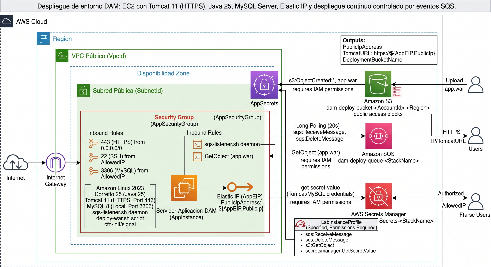{ style="display:block;margin:0 auto;width:100%;max-width:600px;" }

### Resumen de la plantilla

La plantilla de CloudFormation **adjunta en la entrega a este documento**, permite desplegar una instancia EC2 con Tomcat 11 y MySQL 8, configurando automáticamente un entorno seguro y listo para recibir despliegues de aplicaciones web mediante archivos WAR.

!!! Tip Importante
    Se ha realizado iterando con Gemini 3.5 Flash Advanced. Para ello se ha partido de la práctica inicial de Terraform Entregada y el ejemplo de la plantilla única de CloudFormation.
    **Las justificación es que es el backend que han usado mis alumnos de 2ºDAM para el módulo de Proyecto Intermudular. Pues es el Stack propuesto por el profesor de ADA para crear el API REST usando JakartEE 11 (JAX-RS, Jackson, JPA + EclipseLink, etc.) y MySQL como base de datos.**

El proceso no ha sido inmediato pues ha requerido de varias iteraciones y consulta de logs y errores para resolver problemas sobre todo con la configuración de Tomcat, problemas con las contraseñas en MySQL. Así como condiciones de carrera que la IA a solucionado con pequeñas esperas en los puntos críticos o con bucles de intentos.

Se ha eliminado cualquier clave de la plantilla y desde Tomcat se tendrá acceso a ellas a través de variables de entorno seteadas por el secret manager de AWS.

Generar un certificado con AWS con firma válida como en la primera práctica, no ha sido posible pues necesitaba los pem de la CA y AWS no los proporciona.Tendría que usar un Balanceador ALB y un dominio propio para poder generar un certificado válido como en la otra práctica. Otra opción, sería descargar loes .pem del certificado generado por mi proveedor de dominio y subirlo a un s3 para poder usarlos en la configuración de Tomcat. Pero al final he optado por un certificado autofirmado con SSL.

En cuanto al uso de SQS, ha sido una recomendación de la IA porque la otra opción que me ofrecía era tener un script que mediante un cronjob revisara el bucket S3 cada 3 minutos para ver si había un nuevo archivo WAR y lo desplegara en Tomcat. La opción de SQS me ha parecido más elegante y eficiente y permite que la instancia EC2 reciba notificaciones de forma inmediata cuando se sube un nuevo archivo WAR al bucket S3 sin gastar recursos de CPU y memoria en la instancia EC2 para revisar el bucket S3 continuamente.

Se podrá acceder por SSH desde PuTTY usando el .PKK descargado con la vockey que se pasa como parámetro de entrada a la plantilla.

!!! Note Nota
    Aunque el despliegue la idea es hacerlo desde el bucket S3, también **se ha habilitado el acceso al Tomcat Manager** para poder subir el archivo WAR directamente desde el navegador web. Para ello se ha configurado un usuario y contraseña en el archivo **`/opt/tomcat/conf/tomcat-users.xml`** y se ha habilitado el acceso al Tomcat Manager desde cualquier IP.

#### Recursos creados

1. **Instancia EC2**: Amazon Linux 2023 con Tomcat 11, MySQL 8 y Java Corretto 25.
2. **Elastic IP**: Dirección IP pública fija para la instancia.
3. **Grupo de seguridad**: Permite tráfico HTTPS (443) desde cualquier IP, SSH (22) y MySQL (3306) solo desde la IP permitida.
4. **Bucket S3**: Para almacenar el archivo `app.war` y notificar a la instancia EC2 mediante SQS.
5. **Cola SQS**: Para recibir notificaciones de subida de archivos al bucket S3.
6. **Secret Manager**: Para almacenar de forma segura las credenciales sensibles de Tomcat y MySQL.
7. **Servicios Systemd**: Para mantener Tomcat y el listener de SQS activos permanentemente.
8. **Scripts de despliegue**: Scripts para desplegar automáticamente el archivo `app.war` en Tomcat al recibir notificaciones de SQS.
9. **Logs de auditoría**: Se registran los eventos de despliegue exitosos en `/var/log/tomcat-deployments.log`.
10. Certificado SSL autofirmado para habilitar HTTPS en Tomcat.

#### Parámetros de entrada

Los parámetros de entrada permiten personalizar la VPC, subred, tipo de instancia, claves SSH y credenciales sensibles para Tomcat y MySQL. Además, se configura un bucket S3 para almacenar los archivos WAR y una cola SQS para notificar a la instancia EC2 sobre nuevos despliegues.

El despliegue del lab se ha hecho con estos valores de plantilla:

**Nombre de la pila**: EC2-con-Tomcat11-y-MySQL8

* **AllowedIP**: 88.17.35.54/32 (Mi IP de O2)
* **HmacShaKey**: CursoCefireIaCJunio2026!
* **InstanceType**: t3.medium
* **KeyName**: vockey
* **MysqlRemoteUser**: uremoto
* **MysqlRemotePass**: CursoCefireIaCJunio2026!
* **MysqlRootPass**: CursoCefireIaCJunio2026!!
* **TomcatPass**: CursoCefireIaCJunio2026!
* **TomcatUser**: tomcat

### Proceso de despliegue

#### 1. Seleccionar la plantilla de CloudFormation que se adjunta a este documento.

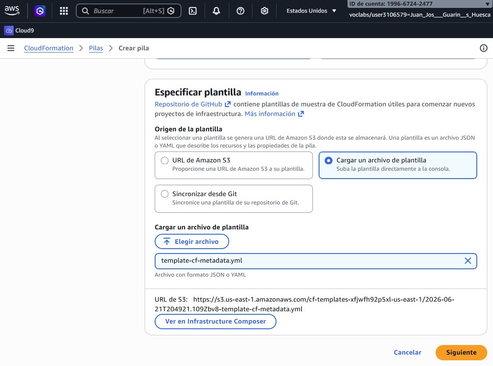{ style="display:block;margin:0 auto;width:100%;max-width:550px;" }

#### 2. Introducir los parámetros de entrada según la configuración deseada.

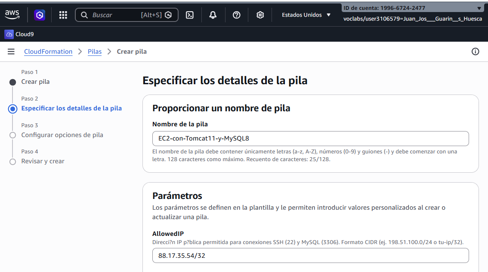{ style="display:block;margin:0 auto;width:100%;max-width:550px;" }

#### 3. Configurar el Rol de IAM del Laboratorio para permitir que se creen los recursos necesarios (EC2, S3, SQS, Secret Manager).

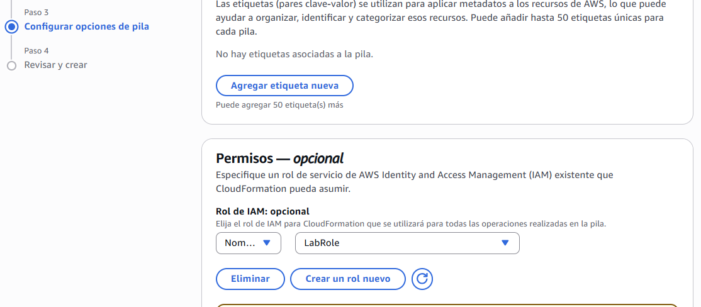{ style="display:block;margin:0 auto;width:100%;max-width:550px;" }

#### 4. Esperar a que la pila se cree correctamente y **revisar los logs de eventos cfn-init** para verificar que todos los pasos se han ejecutado sin errores.

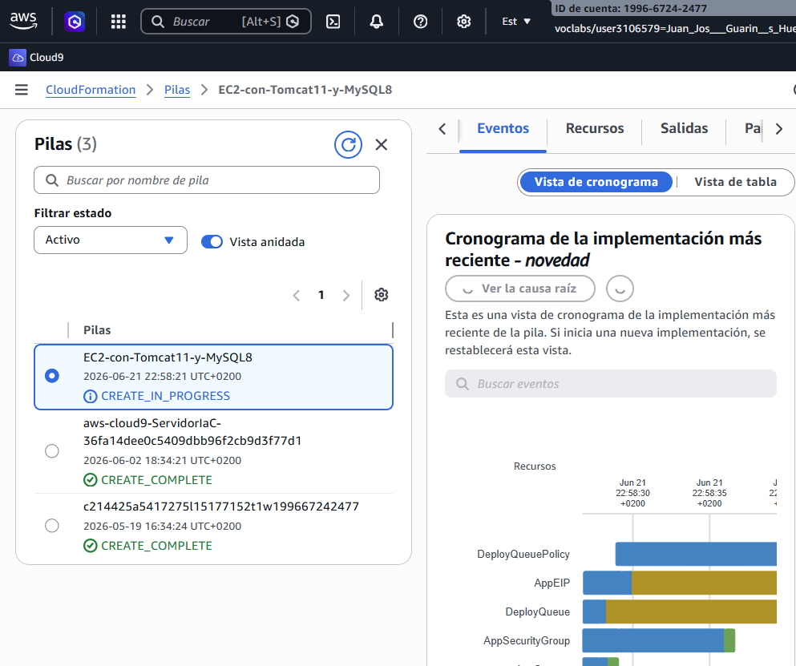{ style="display:block;margin:0 auto;width:100%;max-width:550px;" }

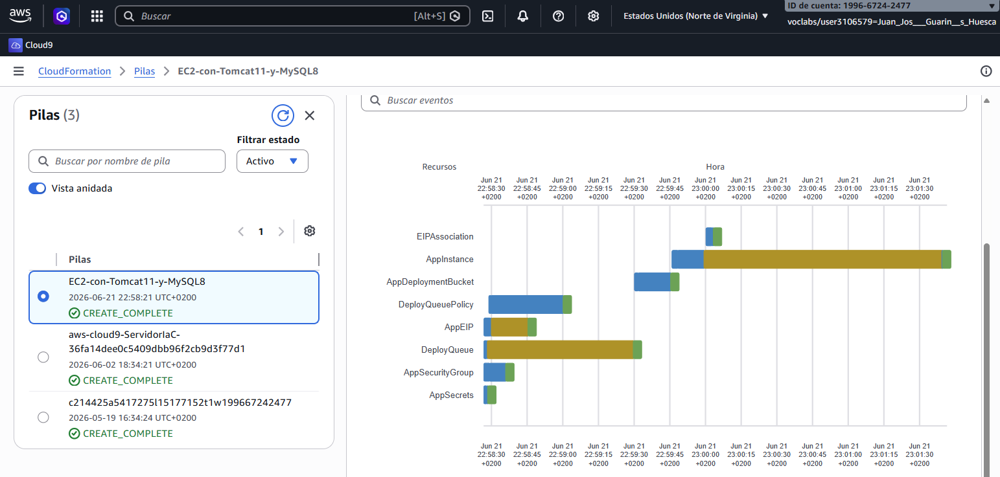{ style="display:block;margin:0 auto;width:100%;max-width:550px;" }

#### 5. Capturo los outputs de la plantilla

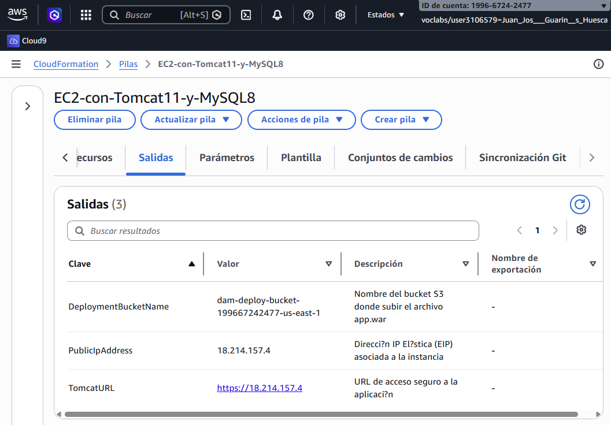{ style="display:block;margin:0 auto;width:100%;max-width:550px;" }

**IP API**: **`https://18.214.157.4/`**
**Bucket Despliegue**: **`dam-deploy-bucket-199667242477-us-east-1`**

Para desplegar ejecutaré el siguiente en mi workflow de GitHub Actions:

```shell
aws s3 cp app.war s3://dam-deploy-bucket-199667242477-us-east-1/app.war
```

#### 6. Compruebo **Secrets Manager** y que se han creado correctamente.

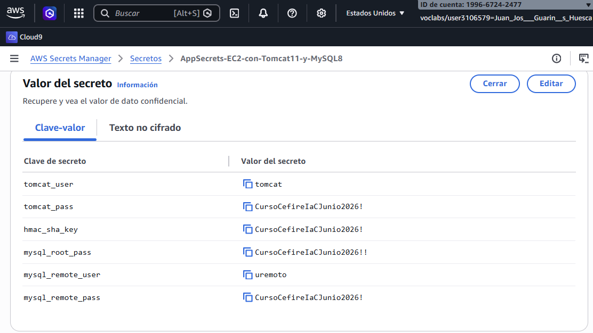{ style="display:block;margin:0 auto;width:100%;max-width:550px;" }

#### 7. Visito la URL del Tomcat

Compruebo el funcionamiento de Tomcat. Veo que funciona, pero el navegador me indica que el certificado no es válido porque es autofirmado. Esto es normal y esperado.

También compruebo que el acceso al Tomcat Manager funciona correctamente con el usuario y contraseña configurados en el Secret Manager.

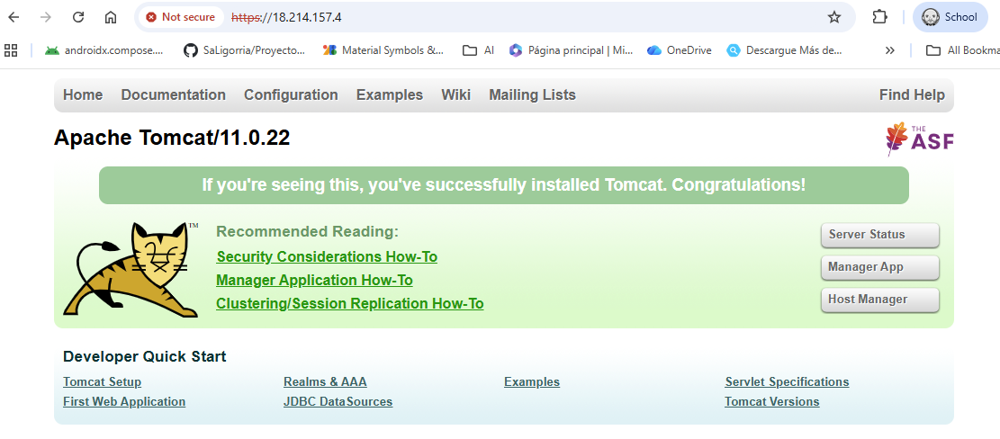{ style="display:block;margin:0 auto;width:100%;max-width:550px;" }

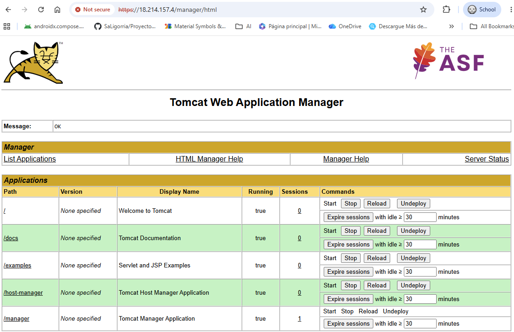{ style="display:block;margin:0 auto;width:100%;max-width:550px;" }

#### 8. Pruebo a conectar con MySQL 

Uso el usuario remoto creado en la plantilla a través de MySQL Workbench y compruebo que funciona correctamente.

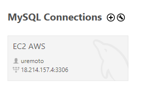{ style="display:block;margin:0 auto;width:100%;max-width:300px;" }

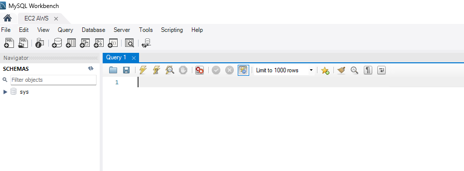{ style="display:block;margin:0 auto;width:100%;max-width:500px;" }

#### 9. SSH a la máquina de EC2 

Uso PuTTY usando la clave privada descargada y compruebo logs convirtiéndome en root para ello ejecuto:

```shell
# Comando para cambiar a usuario root
sudo su
```

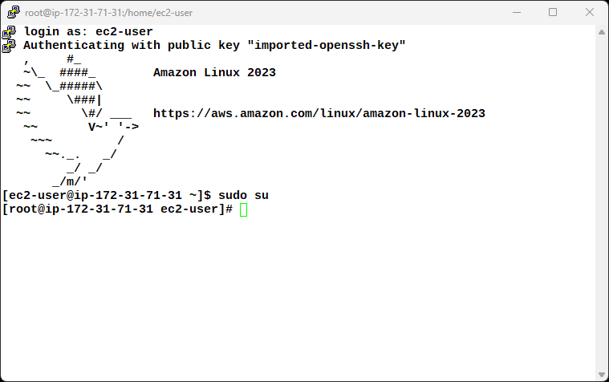{ style="display:block;margin:0 auto;width:100%;max-width:550px;" }

```shell
# Comando para revisar los puertos abiertos
ss -tlnp
```

Puedo depurar Java, pero solo desde la instancia EC2, no desde mi máquina local. Esto es normal y esperado porque el puerto 8000 no está abierto en el grupo de seguridad de la instancia EC2.

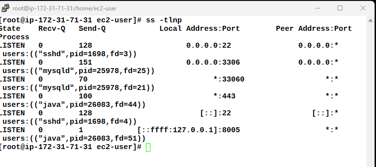{ style="display:block;margin:0 auto;width:100%;max-width:550px;" }


```shell
# Comando para revisar los logs de cfn-init
tail -f /var/log/cfn-init-cmd.log
```

Algunos avisos de comandos de MySQL y de la creación de los servicios de escucha de SQS y de Tomcat, pero no hay errores. Todo correcto.

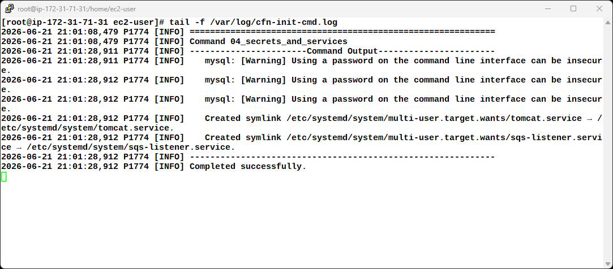{ style="display:block;margin:0 auto;width:100%;max-width:550px;" }

```shell
# Comando para revisar el estado del servicio de Tomcat
systemctl status tomcat
# Comando para revisar los logs de Tomcat
tail -n 50 /opt/tomcat/logs/catalina.out
```

Parece todo correcto y el servicio está activo como comprobamos.

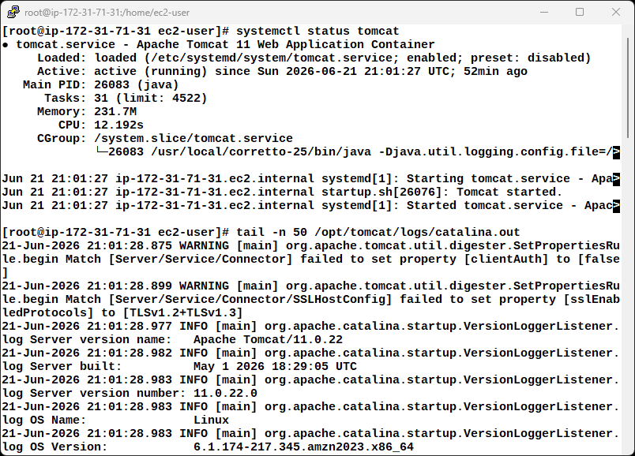{ style="display:block;margin:0 auto;width:100%;max-width:550px;" }

Por no extenderme mucho más, dejo algunos comandos útiles para depurar y revisar el estado de la instancia EC2, Tomcat y MySQL:

```shell
# Comando para revisar el archivo de configuración de usuarios de Tomcat
cat /opt/tomcat/conf/tomcat-users.xml

# Comando para revisar los logs de MySQL
tail -f /var/log/mysqld.log

# Comando para conectarse a MySQL con el usuario root 
# y verificar si se ha creado el usuario remoto
mysql -u uremoto -pCursoCefireIaCJunio2026!
musql> quit

# Mostrar los logs de despliegue de Tomcat
tail -f /var/log/tomcat-deployments.log
```
