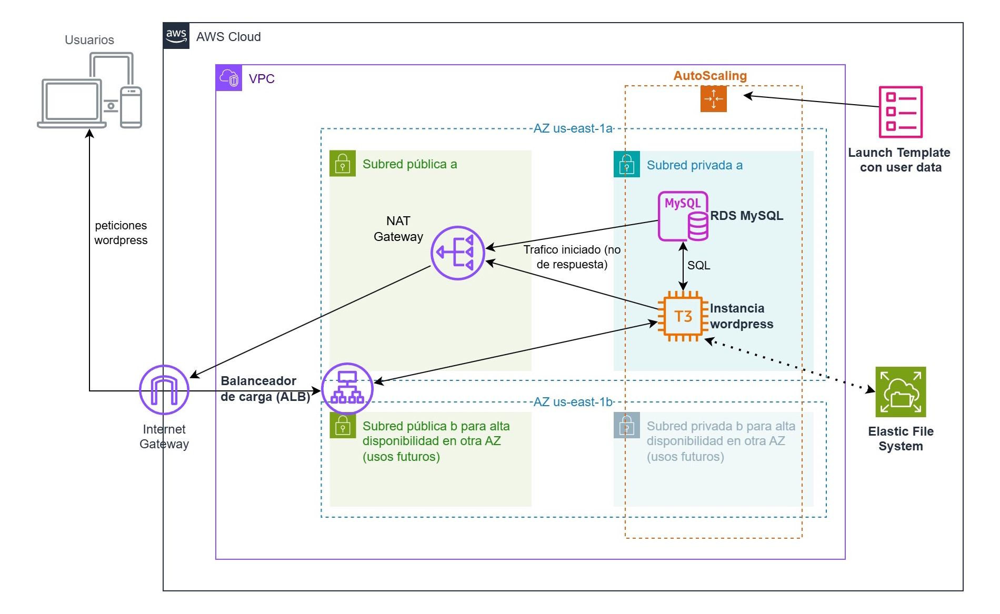

# Terraform

## En este espacio os ofrecemos los recursos que hemos elaborado para Terraform:

### [Presentación con los conocimientos básicos sobre Terraform](https://formacioncloud.github.io/IaC/03_terraform) y que abarca:
  ⚪ Instalación y configuración básica de Terraform 
  ⚪ Estructura básica de un proyecto 
  ⚪ Lenguaje HCL 
  ⚪ Terraform CLI 
  ⚪ Variables (Local Values, Input Variables), Outputs 
  ⚪ Providers, Resources, DataSources 
  ⚪ Mapeo y gráfico de dependencias y grafico 
  ⚪ Gestión del estado 
  ⚪ Workspaces 
  ⚪ Aspectos avanzados (I): Modules, Expressions, Functions 
  ⚪ Aspectos avanzados (II): Provisioners 

### Práctica **[Terraform en AWS – Infraestructura para aplicación web](./practica-terraform-aws)**
  En esta práctica construiremos desde cero una infraestructura en AWS usando Terraform. 
  
  **Desplegaremos una aplicación web (WordPress) preparada para alta disponibilidad**:  
    -Infraestructura de red y Nat Gateway  
    -Cortafuegos 
    -Servidores web EC2 en múltiples AZs (inicialmente sólo uno)  
    -Un balanceador de carga sobre Target Group 
    -Un Autoscaling group asociado  
    -Base de datos gestionada (Amazon RDS)  
    -Sistema de archivos compartido (Amazon EFS) que contendrá tanto código como assets.  

  
  A lo largo del proceso, **reforzaremos conceptos claves de Terraform** (proveedores, recursos, variables, estado, etc.) y de AWS (VPC, subredes, grupos de seguridad, roles IAM, autoescalado, balanceador de carga, EC2, RDS, user-data, etc.), y tareas extra para resolver.

### Añadido [Apartados extra Terraform en AWS](./practica-terraform-aws/apartados_extra_aws.md)

Proponemos una serie de **ampliaciones y mejoras en la práctica**, de las que no proporcionamos resolución directa pero sí indicaciones y que parten de la infraestructura completa, a implementar lógicamente en el código de Terraform y ser aplicadas posteriormente.

### Práctica **Terraform en Azure – Infraestructura para aplicación web**
  Misma infraestructura traducida a Azure, la cual analizaremos en relación a la anterior.
  
